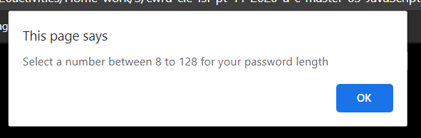
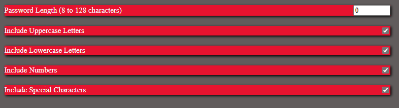
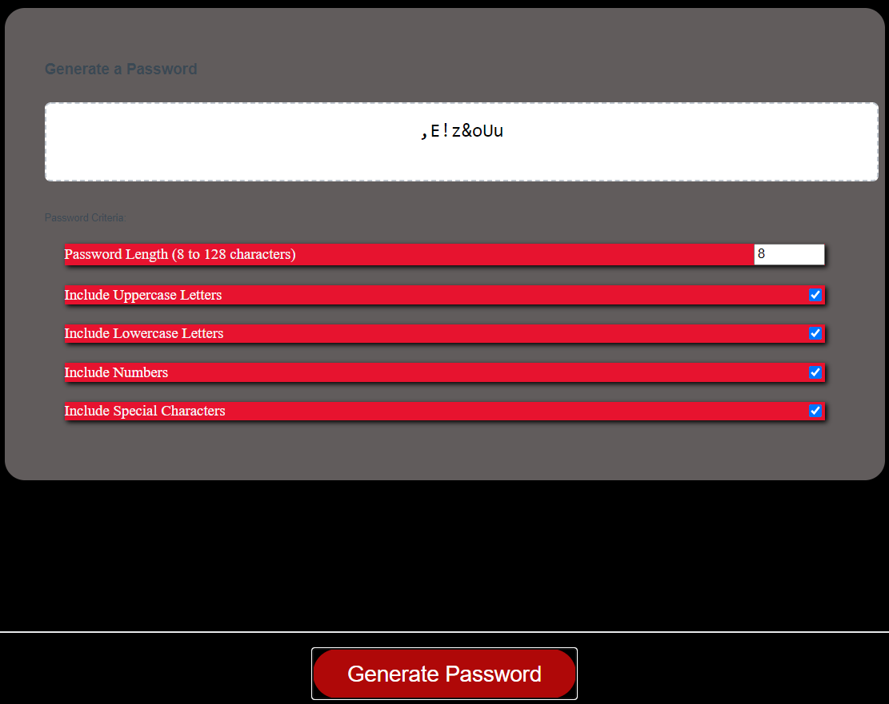

YOU CAN FIND THIS PROJECT BY VISITING THE BELOW LINK:

https://github.com/mouyad-gd/Novclasshomeworkthree.git

* This project has been deployed to GitHub Pages. To get this project up and running, you can follow the deployment link. Or, download the sources files to use this as a template.

* This application emphasizes the use of HTML, Javascript and CSS to generate a random  password for the user based on the preferred password criteria.

## What "Password Generator" do?
: This application help the user to create random password based on the selected criteria.

## Why I should use this application? 
: This application is very helpful, the application help the user to create random password, the generated password could be used for other purposes such as; setting up online accounts.

## Can I log in using my cell phone?
: This application is responsive to all screen size's.

## How many "Password Criterias" are available in this application?
: Four main criterias are available to be selected/deselected in addition to the Password Length.

## What are the four "Password Criteria's"?
- Uppercase Letters
- Lowercase Letters
- Numbers
- Special Characters

## Instructions: 
- Instructional message will pop up regarding the password length that should be selected.

- The "Page" will load, please select the "password length", Check/uncheck the Uppercase, Lowercase, Numbers and Special characters. 

- Click "Generate Password" button. 

- voilà!   

## Do you have a question: 
: Send your question to: mouyad.gd@gmail.com 